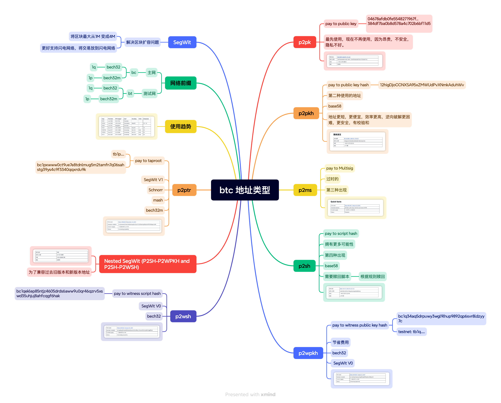
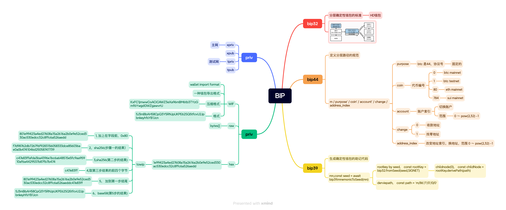
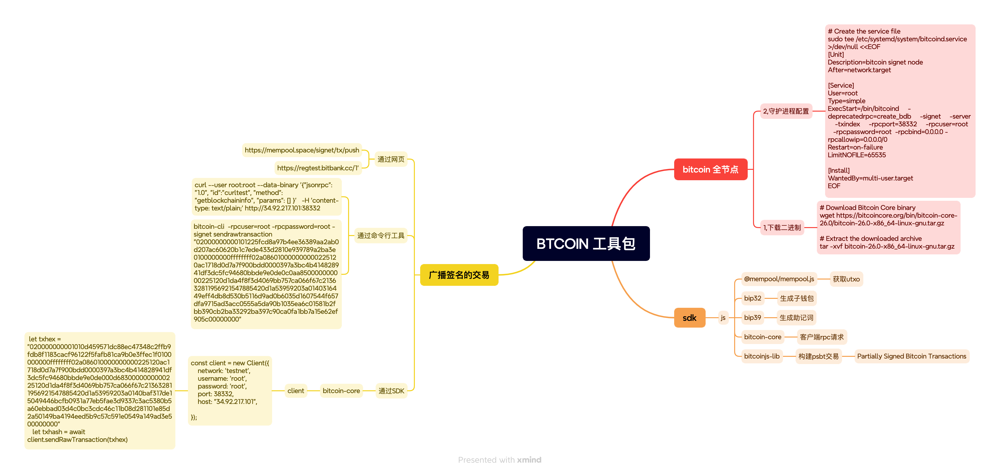
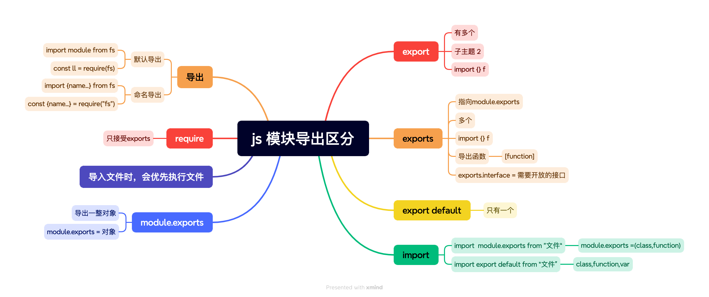

# bb-st

# 1. p2pk,p2pkh,p2wpkh,p2tr,p2sh，p2ms, P2WSH, Nested SegWit (P2SH-P2WPKH and P2SH-P2WSH)

# 2. bip32, bip44, bip39, WIP

# 3. bitcoin 工具包

# js export, export default, module.export, export 区分
